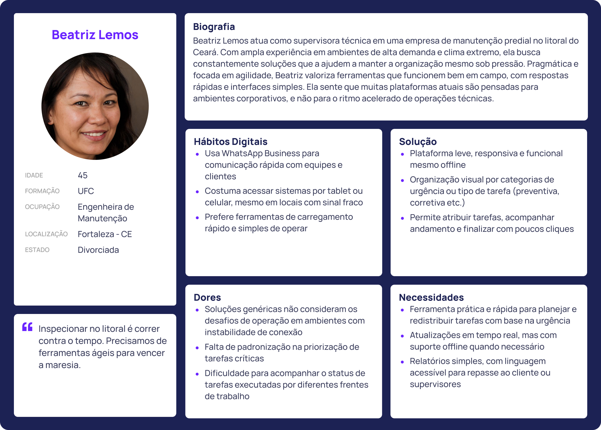

# Web Application Document - Projeto Individual - Módulo 2 - Inteli

**_Os trechos em itálico servem apenas como guia para o preenchimento da seção. Por esse motivo, não devem fazer parte da documentação final._**

## Nome do Projeto

#### Autor do projeto

## Sumário

1. [Introdução](#c1)  
2. [Visão Geral da Aplicação Web](#c2)  
3. [Projeto Técnico da Aplicação Web](#c3)  
4. [Desenvolvimento da Aplicação Web](#c4)  
5. [Referências](#c5)  

 

## 1. Introdução (Semana 01)

&emsp; Atualmente, muitos profissionais enfrentam dificuldades em organizar suas atividades diárias de maneira eficiente, especialmente quando lidam com múltiplos projetos, prazos apertados e equipes diversas. Métodos tradicionais, como anotações em papel, planilhas manuais ou aplicativos não integrados, acabam gerando desorganização, perda de informações importantes e retrabalho constante.

&emsp; Usuários como Laura Martins, Felipe Andrade, Patrícia Souza, Ricardo Lima e Camila Ribeiro relatam que a falta de uma ferramenta prática e centralizada dificulta a gestão de suas rotinas e impacta diretamente na produtividade e na qualidade das entregas.

&emsp; Pensando nessas necessidades, será desenvolvida uma aplicação web focada na organização e gerenciamento de tarefas. A proposta é oferecer uma plataforma intuitiva, que permita o planejamento de atividades, acompanhamento de prazos, categorização de tarefas e colaboração em equipe, promovendo mais controle, eficiência e equilíbrio no dia a dia dos usuários.

---

## 2. Visão Geral da Aplicação Web

### 2.1. Personas (Semana 01)
&emsp; As personas são representações fictícias dos usuários finais do sistema, criadas a partir de dados reais e observações. Elas são essenciais para guiar o desenvolvimento de soluções que atendam às necessidades, objetivos e comportamentos dos usuários. Neste projeto, foram desenvolvidas personas com base em perfis de profissionais que buscam aumentar sua produtividade e organização por meio de ferramentas digitais. O objetivo é entender suas dificuldades, necessidades e preferências no gerenciamento de tarefas diárias, de modo a criar um sistema que ofereça funcionalidades eficientes e intuitivas. Essas personas servirão de base para o desenvolvimento de um gerenciador de tarefas que resolva os principais desafios enfrentados pelos usuários. 

    
     
    Figura 1 - Persona 1
     
    Fonte: Ana Ribeiro, Faculdade Inteli 2025

    
     
    Figura 2 - Persona 2
     
    Fonte: Equipe Primesit, Faculdade Inteli 2025

    
     
    Figura 3 - Persona 3
     
    Fonte: Equipe Primesit, Faculdade Inteli 2025

### 2.2. User Stories (Semana 01)
As **User Stories** são uma técnica ágil utilizada para descrever funcionalidades do sistema a partir da perspectiva do usuário. Elas são essenciais para garantir que as soluções atendam às reais necessidades dos usuários e para orientar o time de desenvolvimento nas entregas de valor. Neste projeto, foram criadas **User Stories** para representar funcionalidades-chave que visam facilitar o gerenciamento de tarefas, melhorando a organização, produtividade e eficiência no dia a dia dos profissionais. Essas histórias guiarão a implementação de ferramentas que atendem aos desafios identificados nas personas.

#### US01 - Cláudia Tavares
Como engenheira civil, quero uma ferramenta que me ajude a organizar minhas tarefas de maneira eficiente, com integração entre diferentes atividades e prazos, para que eu consiga gerenciar meu tempo de forma otimizada e sem sobrecarga.

#### US02 - Marcelo Antunes
Como engenheiro civil, quero uma plataforma que permita visualizar e gerenciar minhas tarefas de forma clara, priorizando-as com base em urgência e importância, para que eu possa ser mais produtivo e cumprir meus prazos sem estresse.

#### US03 - Rafael Souza
Como técnico em edificações, quero um aplicativo móvel simples que me permita adicionar e acompanhar minhas tarefas de campo de maneira prática, para que eu possa manter o foco no que precisa ser feito e não me perder nas demandas diárias.

&emsp; Após definir as **User Stories**, é fundamental analisar cada uma delas sob a ótica do modelo **INVEST**. Essa abordagem ajuda a garantir que as histórias sejam bem estruturadas, viáveis e entreguem valor ao usuário de forma eficaz. O modelo **INVEST** — que significa **Independente**, **Negociável**, **Valiosa**, **Estimável**, **Pequena** e **Testável** — oferece critérios claros para validar a qualidade de cada **User Story**, assegurando que sejam funcionais, fáceis de desenvolver e testáveis. A seguir, será realizada uma análise detalhada de uma das **User Stories** com base nesses critérios.

#### I – Independente
A **User Story** **US01** é independente, pois não depende de outras funcionalidades ou **User Stories** para ser desenvolvida. Ela descreve uma funcionalidade autossuficiente de organização de tarefas, que pode ser implementada isoladamente.

#### N – Negociável
A funcionalidade descrita é negociável. O comportamento desejado — a organização eficiente das tarefas, com integração de atividades e prazos — pode ser discutido e ajustado conforme as necessidades do usuário ou o desenvolvimento do sistema. A forma de implementação pode ser flexível, permitindo negociações durante a criação da solução.

#### V – Valiosa
Essa **User Story** é valiosa para o usuário, pois atende diretamente a uma necessidade de **Cláudia**: organizar suas tarefas de forma eficiente e sem sobrecarga. Isso ajuda a economizar tempo e a reduzir o estresse ao gerenciar múltiplas responsabilidades, uma preocupação importante para ela.

#### E – Estimável
A **User Story** é estimável, pois é possível calcular o esforço necessário para criar a funcionalidade. Os elementos envolvidos (organizar tarefas, integrar atividades e definir prazos) são atividades claras e mensuráveis, permitindo uma estimativa razoável de tempo e recursos necessários.

#### S – Pequena (Small)
A **User Story** é pequena o suficiente para ser concluída em um ciclo de desenvolvimento. Ela pode ser dividida em subtarefas menores, como a implementação de funcionalidades para adicionar tarefas, definir prazos e categorizar atividades, facilitando o processo de entrega.

#### T – Testável
A **User Story** é testável, pois é possível verificar se o sistema está organizando as tarefas corretamente, com integração entre atividades e prazos. Os testes podem ser realizados em diferentes cenários de uso, garantindo que a funcionalidade esteja funcionando como esperado.

---

## 3. Projeto da Aplicação Web

### 3.1. Modelagem do banco de dados  (Semana 3)

*Posicione aqui os diagramas de modelos relacionais do seu banco de dados, apresentando todos os esquemas de tabelas e suas relações. Utilize texto para complementar suas explicações, se necessário.*

*Posicione também o modelo físico com o Schema do BD (arquivo .sql)*

### 3.1.1 BD e Models (Semana 5)
*Descreva aqui os Models implementados no sistema web*

### 3.2. Arquitetura (Semana 5)

*Posicione aqui o diagrama de arquitetura da sua solução de aplicação web. Atualize sempre que necessário.*

**Instruções para criação do diagrama de arquitetura**  
- **Model**: A camada que lida com a lógica de negócios e interage com o banco de dados.
- **View**: A camada responsável pela interface de usuário.
- **Controller**: A camada que recebe as requisições, processa as ações e atualiza o modelo e a visualização.
  
*Adicione as setas e explicações sobre como os dados fluem entre o Model, Controller e View.*

### 3.3. Wireframes (Semana 03)

*Posicione aqui as imagens do wireframe construído para sua solução e, opcionalmente, o link para acesso (mantenha o link sempre público para visualização).*

### 3.4. Guia de estilos (Semana 05)

*Descreva aqui orientações gerais para o leitor sobre como utilizar os componentes do guia de estilos de sua solução.*

### 3.5. Protótipo de alta fidelidade (Semana 05)

*Posicione aqui algumas imagens demonstrativas de seu protótipo de alta fidelidade e o link para acesso ao protótipo completo (mantenha o link sempre público para visualização).*

### 3.6. WebAPI e endpoints (Semana 05)

*Utilize um link para outra página de documentação contendo a descrição completa de cada endpoint. Ou descreva aqui cada endpoint criado para seu sistema.*  

### 3.7 Interface e Navegação (Semana 07)

*Descreva e ilustre aqui o desenvolvimento do frontend do sistema web, explicando brevemente o que foi entregue em termos de código e sistema. Utilize prints de tela para ilustrar.*

---

## 4. Desenvolvimento da Aplicação Web (Semana 8)

### 4.1 Demonstração do Sistema Web (Semana 8)

*VIDEO: Insira o link do vídeo demonstrativo nesta seção*
*Descreva e ilustre aqui o desenvolvimento do sistema web completo, explicando brevemente o que foi entregue em termos de código e sistema. Utilize prints de tela para ilustrar.*

### 4.2 Conclusões e Trabalhos Futuros (Semana 8)

*Indique pontos fortes e pontos a melhorar de maneira geral.*
*Relacione também quaisquer outras ideias que você tenha para melhorias futuras.*

## 5. Referências

_Incluir as principais referências de seu projeto, para que seu parceiro possa consultar caso ele se interessar em aprofundar. Um exemplo de referência de livro e de site:_ 

---
---